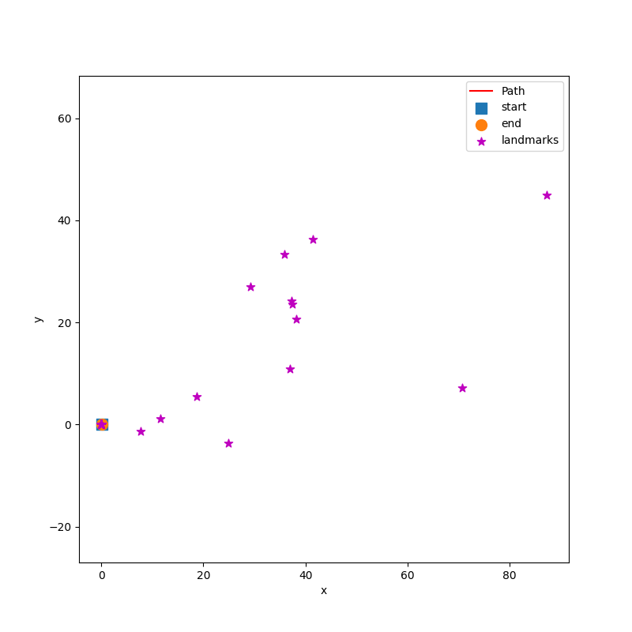
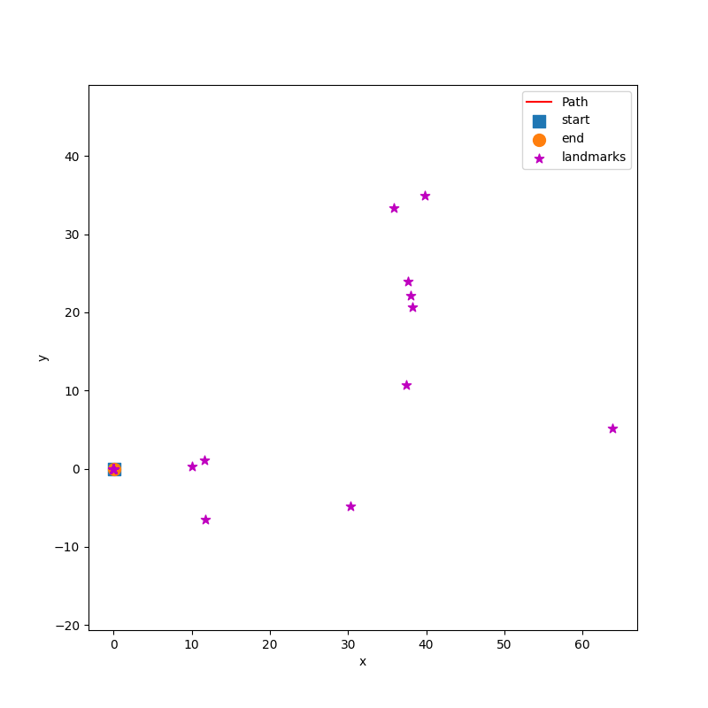

# visual_inertial_SLAM
The goal of this project is to implement visual-inertial simultaneous localization and mapping (SLAM) using an extended Kalman filter (EKF). 

# Installation
```bash
conda create -n vslam python=3.8
conda activate vslam
pip install -r requirements.txt
```

# Usage
1. Use 'python main.py' to run the code with the default config.
2. You can adjust the params in "./config/config.yaml" to get different mapping results. The params are clearly defined with annotation.

# Results
- Only Mapping

<div style="width: 40%; float: left;">
    
</div>

<div style="width: 40%; float: right;">
    
</div>

- Full SLAM(measurement noise assumption=2.0)

<div style="width: 50%; float: left;">
    
</div>

<div style="width: 50%; float: right;">
    
</div>

- Full SLAM(measurement noise assumption=0.1)

<div style="width: 50%; float: left;">
    
</div>

<div style="width: 50%; float: right;">
    
</div>
